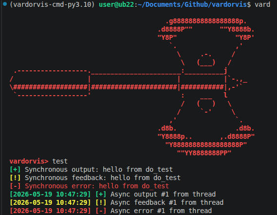

# vardorvis

Vardorvis Command Line Interface. Some custom logging and asynchronous feedback additions to the cmd2 library.

## Features

Logs to vardorvis.log. Creates a file if one does not exist and appends to that file otherwise.

## Set up your virtual environment

```bash
# Install poetry if you haven't already
curl -sSL https://install.python-poetry.org | python3 -

poetry install
source .venv/bin/activate
```

## Installation

Download the python wheel from releases and run the command below.

```bash
pip install vardorvis_cmd-0.4.0-py3-none-any.whl
```

## Usage

```bash
vard
```



**Figure 1.** *Vardorvis UI displaying both regular and asynchronous output.*

*ASCII art pulled from https://www.asciiart.eu/weapons/axes credit to Marcin Glinski*

<br>

End of file
